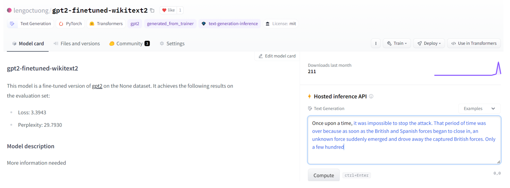
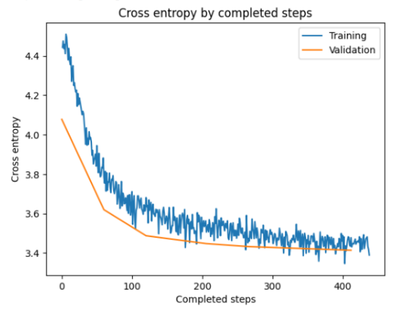
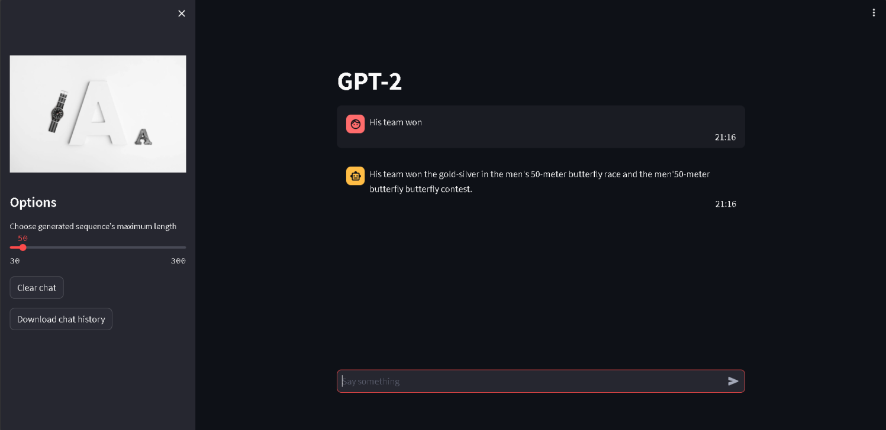

# Research-Transformer-and-fine_tune-GPT2

## Research Transformer and GPT2

- Transformer ([Attention Is All You Need](https://arxiv.org/abs/1706.03762)): architecture, encoder and decoder.
- GPT-2 ([Improving Language Understanding by Generative Pre-Training](https://s3-us-west-2.amazonaws.com/openai-assets/research-covers/language-unsupervised/language_understanding_paper.pdf)): Token/Positional Embedding, Masked Multi Self Attention, FCNN, Inference, Causal Language Modeling.

## Fine tune GPT-2 in wikitext-2

- **Model:** training pre-trained GPT-2 (smallest) from transformers for Causal Language Modeling. My model [here](https://huggingface.co/lengoctuong/gpt2-finetuned-wikitext2).



- **Dataset:** [wikitext-2-raw-v1](https://huggingface.co/datasets/wikitext/viewer/wikitext-2-raw-v1).
- **Hyperparameters:**
    - Input vector size: 128.
    - Batch size: 32.
    - Epochs: 3
    - Optimizer: AdamW.
    - Learning rate: 2e-5.
    - Sheduler: linear.
    - Loss function: cross entropy.
    - Metric: perplexity.
- **Training:** refer to ```[GPT-2]_[CLM]_wikitext2-dataset.ipynb```



## Web app in localhost

- **Framework:** python, streamlit.

### Usage

1. Clone the repository.
```bash
git clone https://github.com/lengoctuong/Research-Transformer-and-fine_tune-GPT2.git
```

2. Dependencies: python, streamlit.
```bash
pip install streamlit
```

3. Running:
```bash
streamlit ./Sources/webapp.py
```

Web app in http://localhost:8501


